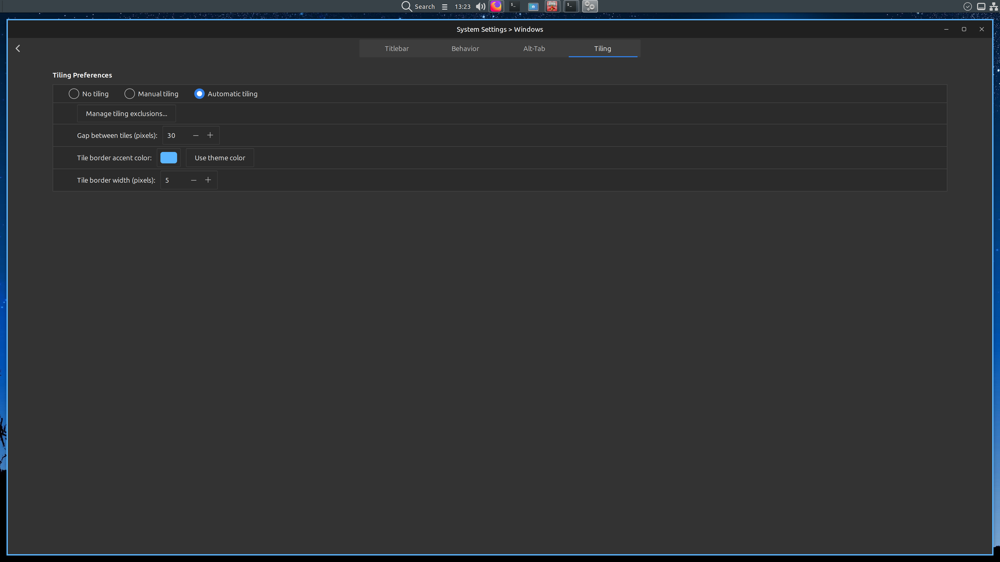

# CinnamonAutoTiling

Automatic window tiling for the Cinnamon desktop environment (Linux Mint).


Windows are automatically arranged when opened or closed:

- **1 window** - fullscreen
- **2 windows** - side by side (vertical split, togglable to horizontal)
- **3 windows** - master + stack layout (mirrorable)
- **4 windows** - 2×2 grid
- **5+ windows** - overflow to the next workspace

All layout behaviour is configurable from **System Settings -> Windows _ Tiling**.

---

## Requirements

- Linux Mint 22.x
- Cinnamon 6.6.x

Other Cinnamon 6.x versions may work but are untested. The installer will warn you if your version differs from 6.6.7.

---

## Files

| File | Destination | Purpose |
|------|-------------|---------|
| `org.cinnamon.muffin.gschema.xml` | `/usr/share/glib-2.0/schemas/` | GSettings schema - adds `auto-tile`, `auto-tile-gap`, `auto-tile-excludelist`, `auto-tile-accent-color`, `auto-tile-border-width` keys |
| `windowManager.js` | `/usr/share/cinnamon/js/ui/` | Core tiling engine, focus border renderer, keybindings |
| `windowMenu.js` | `/usr/share/cinnamon/js/ui/` | Adds an *Exclude from Tiling* toggle to the right-click window menu |
| `cs_windows.py` | `/usr/share/cinnamon/cinnamon-settings/modules/` | Tiling settings UI inside System Settings -> Windows |

---

## Install

```bash
sudo bash install_autotiling.sh
```

The installer will:

1. Check that all source files are present
2. Warn if your Cinnamon version differs from 6.6.7
3. Back up the original system files to `./backups/` (only on the first run)
4. Install the schema and recompile GLib schemas
5. Install the three JS and Python files
6. Verify that all new GSettings keys are readable

After installation, restart Cinnamon:

> Right-click the panel -> Troubleshoot -> Restart Cinnamon

Then enable tiling in:

> System Settings -> Windows -> Tiling Preferences




---

## Uninstall

```bash
sudo bash install_autotiling.sh --uninstall
```

This restores all original system files from `./backups/` and resets the new GSettings keys to their defaults.

---

## Configuration

All settings are in **System Settings -> Windows -> Tiling Preferences**.

| Setting | Description |
|---------|-------------|
| Tiling mode | None / Manual edge-tiling / Automatic tiling |
| Gap between tiles | 0–50 px gap between windows and screen edges |
| Tile border accent color | Color of the focus border on the active tiled window; empty = use GTK theme color |
| Tile border width | 0–10 px; set to 0 to disable the border entirely |
| Tiling exclusions | Per-app exclusion list - excluded windows float freely |

### Excluding an app at runtime

Right-click the titlebar of any window -> **Exclude from Tiling**. The exclusion is saved immediately and the layout reflows.

### Keyboard shortcuts (when auto-tiling is active)

| Shortcut | Action |
|----------|--------|
| `Super + Arrow Up/Down` | Rotate/cycle tile layout |
| `Super + Arrow Left/Right` | Mirror tiles |
| `Super + Tab` | Change tile focus (select tiles) |
| `Super + Shift + Arrow Left/Right` | Resize tiles |
| `Ctrl + Alt + Arrow Left/Right` | Cycle/change workspaces horizontally |
| `Super + Shift + Page Up/Down` | Cycle/change workspaces vertically when window effects are enabled, otherwise cycle/change workspaces horizontally |
---

## How it works

**`windowManager.js`** hooks into Cinnamon's window-created and window-destroyed signals. When auto-tiling is enabled it tracks all normal, non-excluded windows on the active workspace and calls `_autoTileWorkspace()` to compute and apply tile rectangles. Muffin's built-in tile-preview ghost is suppressed while auto-tiling is active so it doesn't interfere.

**`windowMenu.js`** reads the `auto-tile-excludelist` GSettings key and, when auto-tiling is on, adds a checkable *Exclude from Tiling* item to the window context menu.

**`cs_windows.py`** extends the Windows module in Cinnamon Settings with a Tiling page containing radio buttons for the three tiling modes and reveal-rows for the gap, color, border-width, and exclusion-list controls.

**`org.cinnamon.muffin.gschema.xml`** is the full Muffin schema with five new keys added. It replaces the system schema and is compiled by the installer with `glib-compile-schemas`.

---

## Backup location

Original system files are saved to `./backups/` next to the install script on the first install run:

```
backups/
  org.cinnamon.muffin.gschema.xml.stock
  windowManager.js.stock
  windowMenu.js.stock
  cs_windows.py.stock
```

Subsequent installs skip the backup step so your originals are always preserved.

---

## Troubleshooting

**Tiling doesn't activate after install**
Restart Cinnamon (right-click panel -> Troubleshoot -> Restart Cinnamon) and confirm Auto-tiling is selected in System Settings -> Windows -> Tiling Preferences.

**GSettings key errors on install**
Run `sudo glib-compile-schemas /usr/share/glib-2.0/schemas/` manually, then retry.

**A window won't tile**
Open System Settings -> Windows -> Tiling Preferences -> Manage tiling exclusions and check whether its WM class is in the exclusion list.

**Restore original files manually**
```bash
sudo cp backups/windowManager.js.stock /usr/share/cinnamon/js/ui/windowManager.js
sudo cp backups/windowMenu.js.stock    /usr/share/cinnamon/js/ui/windowMenu.js
sudo cp backups/cs_windows.py.stock    /usr/share/cinnamon/cinnamon-settings/modules/cs_windows.py
sudo cp backups/org.cinnamon.muffin.gschema.xml.stock /usr/share/glib-2.0/schemas/org.cinnamon.muffin.gschema.xml
sudo glib-compile-schemas /usr/share/glib-2.0/schemas/
```

---

## License

This project patches files from the [Cinnamon](https://github.com/linuxmint/Cinnamon) and [Muffin](https://github.com/linuxmint/muffin) projects, which are licensed under the GNU General Public License v2.0. Modifications and additions in this repository are released under the same license.
